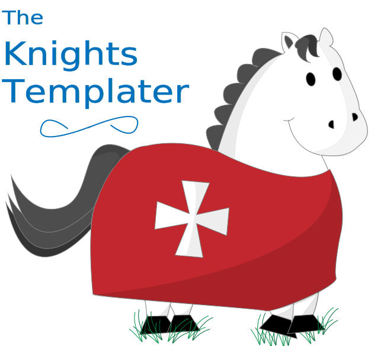

.. Knights Templater documentation master file, created by
   sphinx-quickstart on Sat Mar 28 13:12:00 2015.

Contents:

.. toctree::
   :maxdepth: 2

   loader
   helpers
   tags
   library

   internals/index

Requirements
============

Python 3.4+

Introduction
============

Knights Templater is a light-weight, super-fast template engine which compiles
your templates into Python classes.

The syntax is based on Django's DTL, but as it allows raw Python the need for
filter piping has been obviated.

Quick Start
===========

Compile and render a template from a string:

.. code-block:: python

    >>> import knights
    >>> tmpl = knights.kompile('Hello {{ name }}, how are you?')
    >>> print(tmpl({'name': 'Bob'}))
    Hello Bob, how are you?

Load a template from a directory:

.. code-block:: python

   >>> from knights import loader
   >>> loader.add_path('templates/')
   >>> tmpl = loader.load_template('index.html')
   >>> tmpl({....})
   ...

Since WSGI wants an iterable for its content:

.. code-block:: python

   >>> content = tmpl.iterator(context)

Thanks
======

Many thanks to Markus Holterman for soundboarding for all my ideas.

See `Green Tree Snakes`_ for an excellent introductin to Python AST.

.. _Green Tree Snakes: https://greentreesnakes.readthedocs.org/en/latest/
